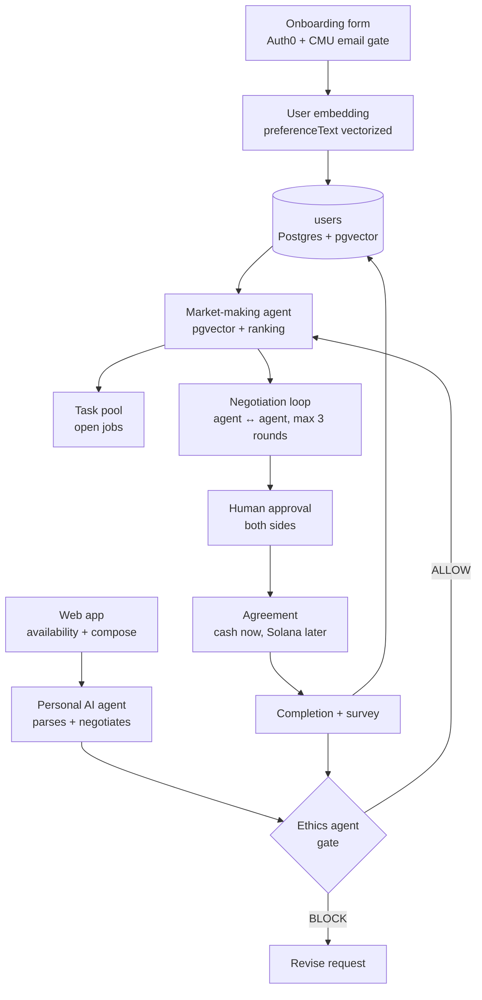

# Gotchu — 24-Hour Build Spec

**"Need something?" → "Gotchu."**

A text-first task marketplace for verified CMU students. You type what you need in plain English; your personal AI agent structures it, an ethics agent gates it, a market-making agent finds candidates and negotiates with *their* agents, and humans only come back in to approve the deal.

**Team:** Will (onboarding) · Thomas (personal AI agent) · Divya (market-making: matching engine) · Daphne (market-making: negotiation + task pool + ethics agent)

---

## 0. The one thing that decides whether this ships

Four people, 24 hours, one codebase. The failure mode is not "the agents weren't smart enough" — it's that at hour 18 nobody's pieces fit together. So:

**Hours 0–2 are for contracts, not features.** Everyone agrees on the Postgres tables, the state machine, and the API routes. Then everyone builds behind a mock and integrates against real data at T+8.

**DB lock (team decision):** PostgreSQL on the existing Railway project, with **pgvector** for preference matching. We are **not** using MongoDB Atlas — do not create an Atlas cluster, do not add `mongodb` as a dependency, do not write `lib/mongo.ts`.

Ship rule: every workstream must have a hardcoded fallback. If the LLM call fails at demo time, the route returns a canned-but-valid object. Judges never see a stack trace.

---

## 1. Locked stack

| Layer | Choice | Why |
|---|---|---|
| App | Next.js 15 (App Router) + TypeScript | One repo, API routes and UI together, one Vercel deploy |
| UI | Tailwind + shadcn/ui | Fast, and we control the look (see §9) |
| Auth | Auth0 | CMU email gating happens in an Action, not our code |
| DB | **PostgreSQL + pgvector** (Railway) | Already have the project; no Mongo |
| Agents | Claude API with tool use / structured JSON output | Three agents, one shared client |
| Embeddings | **Gemini `text-embedding-004`** (768 dims) | Same job as OpenAI's, and it qualifies us for the Gemini prize (§2) |
| Voice | **ElevenLabs** on the negotiation replay | Cheap, and it improves the best screen we have (§2) |
| Payments | Solana devnet, feature-flagged off | Prize target, but last in (§8) |
| Deploy | Vercel (app) + Railway Postgres | App and DB stay separate |

Repo: `gotchu/` — single Next.js app. No microservices. No separate Python backend. Everything is a route handler.

---

## 2. Sponsor prize strategy

HackCMU runs six MLH sponsor prizes: **Gemini API, ElevenLabs, Solana, Vultr, Auth0, MongoDB Atlas.** Each is awarded per team member, and they stack with the main HackCMU judging — so they're close to free upside, *as long as chasing them doesn't degrade the core product.* That's the trade to keep in mind: a team that bolts on six APIs and wins none of the main prizes has lost.

Gotchu already touches Auth0 without adding a line of code. We're targeting **Auth0, Gemini, ElevenLabs, with Solana as a fourth**, and **skipping MongoDB Atlas and Vultr**. The team locked Postgres on Railway; chasing Atlas just to tick a box is how we waste the night.

### The ranking, by value per hour of work

**1. Auth0 — target hard. This is our best fit at the whole event.**
The Auth0 prize page specifically points at *Auth0 for AI Agents*, and Gotchu is almost a textbook case for it: agents act on a user's behalf, within a delegated limit, and escalate to a human at the boundary. We don't have to bolt anything on — we have to *name* what we already built.

Frame it this way in the writeup and the pitch: the personal agent holds delegated authority up to the user's reservation price; anything outside that envelope requires human approval, which is exactly what the approval card in §4 enforces. Plus the Post-Login Action doing domain-verified CMU gating with custom claims.

→ **Will**: read the Auth0 for AI Agents docs during your T+2→T+6 block, not as an afterthought. If there's a token-vault or async-authorization primitive that maps onto our approval step in under an hour, use it. If not, the framing alone is still strong.

**2. MongoDB Atlas — skip. We are on Postgres.**
Do not sign up for Atlas. Do not install `mongodb`. Matching is **pgvector** over `users.preference_embedding` (768-dim Gemini vectors, cosine distance). Divya presents that query, not an aggregation pipeline.

→ **Divya** gets the Railway `DATABASE_URL` from Will at T+0. Enable the `vector` extension in hour 1 (`CREATE EXTENSION IF NOT EXISTS vector`).

**3. Gemini — a one-file change.**
Swap `lib/embed.ts` from OpenAI to Gemini's `text-embedding-004`. Same interface, same call site, and it legitimately qualifies us. **Note the dimension: 768** — the Postgres column is `vector(768)`. Wrong width and inserts fail.

If we want a second, more visible Gemini surface: run the ethics agent on Gemini and the personal/negotiation agents on Claude. That's defensible on the merits (a cheap fast classifier vs. a reasoning-heavy negotiator) and gives a better answer than "we swapped one API call" when a judge asks why.

→ **Will** owns `embed.ts`. **Daphne** owns `ethics.ts`.

**4. ElevenLabs — the rare integration that makes the project better.**
TTS on the negotiation replay: two distinct voices reading the agents' one-line rationales as the transcript plays. It's ~45 minutes on a screen Daphne is already building, and it turns our best demo moment into something people remember. Pre-generate the audio when the negotiation resolves, cache the URLs on the offer row, play on reveal.

Optional second surface if there's slack: voice intake on the compose screen — hold to speak, transcribe, feed the same `parseTask`. Text-first is still the product; voice is an accessibility affordance, not a pivot.

→ **Daphne**, at T+16, only after the approval flow works. Feature-flag it.

**5. Solana — the real decision, and the only one that costs us.**
Ledger Nano S Plus per team member, and the prize framing calls out consumer payments and high-frequency transactions, which is precisely what a campus micropayment market is. See §8 for scope.

This is the only prize on the list that trades against core polish, so it gets committed last. If we're on schedule at the T+14 checkpoint, pull it forward from T+20. If we're not, cut it without debate.

**6. Vultr — skip.**
We're on Vercel. Contorting deployment for a sixth prize is how teams lose the grand prize chasing swag.

### What this means for the submission form

MLH prizes are claimed per-challenge on the submission, and teams lose them by forgetting to tick the box. At T+22, when Will fills the form: tick **Auth0, Gemini, ElevenLabs**, plus **Solana** if it shipped. **Do not tick MongoDB.** Write one sentence per prize explaining the integration — judges skim, and "we used it" loses to "we used it *for this*."

---

## 3. Data model

Five tables. Nested blobs (`structured`, `ethics`, `transcript`, `stats`, `payment`) live in `jsonb` so the TypeScript shapes in `lib/types/` stay the same. **Never rename or remove** columns marked 🔒 — other people's code reads them.

`uuid` / `task_id` are our public IDs. There is no Mongo `_id`. Do not expose `auth0_sub` or `phone` to the client.

### `users`

```sql
CREATE TABLE users (
  uuid                  TEXT PRIMARY KEY,          -- 🔒 usr_…
  auth0_sub             TEXT UNIQUE NOT NULL,      -- 🔒
  first_name            TEXT NOT NULL,             -- 🔒
  last_name             TEXT NOT NULL,             -- 🔒
  cmu_email             TEXT UNIQUE NOT NULL,      -- 🔒
  phone                 TEXT NOT NULL,             -- 🔒 E.164
  preference_text       TEXT NOT NULL,
  preference_embedding  vector(768),               -- Gemini text-embedding-004
  is_available          BOOLEAN NOT NULL DEFAULT false,
  available_until       TIMESTAMPTZ,
  stats                 JSONB NOT NULL DEFAULT '{"tasksCompleted":0,"tasksRequested":0,"avgRating":null,"ratingCount":0}',
  created_at            TIMESTAMPTZ NOT NULL DEFAULT now(),
  updated_at            TIMESTAMPTZ NOT NULL DEFAULT now()
);
```

`preference_text` is the star. It's free-text, it's what gets embedded, and it's what the personal agent reads to negotiate on someone's behalf. Onboarding should push people to write 2–3 sentences, not check boxes.

### `tasks`

```sql
CREATE TABLE tasks (
  task_id              TEXT PRIMARY KEY,           -- 🔒 tsk_…
  requester_uuid       TEXT NOT NULL REFERENCES users(uuid), -- 🔒
  raw_text             TEXT NOT NULL,
  structured           JSONB NOT NULL,             -- 🔒 StructuredTask
  task_embedding       vector(768),
  ethics               JSONB,                      -- 🔒 EthicsVerdict
  status               TEXT NOT NULL,              -- 🔒 see §4
  matched_worker_uuid  TEXT REFERENCES users(uuid),
  agreed_price_usd     NUMERIC,
  created_at           TIMESTAMPTZ NOT NULL DEFAULT now(),
  updated_at           TIMESTAMPTZ NOT NULL DEFAULT now()
);
```

`structured` JSON: `{ title, category, pickupLocation, dropoffLocation, deadline, maxPriceUsd, estimatedMinutes, requirements }`. Category: `pickup | food | moving | errand | tutoring_allowed | other`.

### `offers` — one row per negotiation between a task and a candidate worker

```sql
CREATE TABLE offers (
  offer_id         TEXT PRIMARY KEY,               -- ofr_…
  task_id          TEXT NOT NULL REFERENCES tasks(task_id), -- 🔒
  worker_uuid      TEXT NOT NULL REFERENCES users(uuid),    -- 🔒
  match_score      NUMERIC NOT NULL,
  transcript       JSONB NOT NULL DEFAULT '[]',    -- 🔒 NegotiationMessage[]
  outcome          TEXT NOT NULL DEFAULT 'PENDING', -- PENDING | AGREED | FAILED | WITHDRAWN
  final_price_usd  NUMERIC,
  created_at       TIMESTAMPTZ NOT NULL DEFAULT now(),
  UNIQUE (task_id, worker_uuid)
);
```

### `agreements`

```sql
CREATE TABLE agreements (
  task_id                 TEXT PRIMARY KEY REFERENCES tasks(task_id),
  requester_uuid          TEXT NOT NULL REFERENCES users(uuid),
  worker_uuid             TEXT NOT NULL REFERENCES users(uuid),
  final_price_usd         NUMERIC NOT NULL,
  terms                   JSONB NOT NULL DEFAULT '[]',
  requester_approved_at   TIMESTAMPTZ,
  worker_approved_at      TIMESTAMPTZ,
  payment                 JSONB NOT NULL DEFAULT '{"method":"cash","solanaTxSig":null,"status":"unpaid"}',
  created_at              TIMESTAMPTZ NOT NULL DEFAULT now()
);
```

### `reviews`

```sql
CREATE TABLE reviews (
  task_id         TEXT NOT NULL REFERENCES tasks(task_id),
  rater_uuid      TEXT NOT NULL REFERENCES users(uuid),
  rated_uuid      TEXT NOT NULL REFERENCES users(uuid),
  rating          INT NOT NULL CHECK (rating BETWEEN 1 AND 5),
  survey_answers  JSONB NOT NULL,
  comment         TEXT,
  ethics_flag     TEXT,                            -- set by ethics agent if the comment describes a violation
  created_at      TIMESTAMPTZ NOT NULL DEFAULT now()
);
```

### Indexes — run these in hour 1 (`scripts/create-schema.ts`)

```sql
CREATE EXTENSION IF NOT EXISTS vector;

CREATE UNIQUE INDEX users_cmu_email_idx ON users (cmu_email);
CREATE UNIQUE INDEX users_auth0_sub_idx ON users (auth0_sub);
CREATE INDEX tasks_status_created_idx ON tasks (status, created_at DESC);
CREATE INDEX users_pref_vec_idx ON users
  USING ivfflat (preference_embedding vector_cosine_ops) WITH (lists = 10);
```

`ivfflat` needs a few rows before it is useful — seed 25 users first, then create the vector index. Until then, cosine `<=>` still works as a sequential scan, which is fine at hackathon scale.

Filter in SQL (`WHERE is_available = true`), not in an Atlas-style index declaration. There is no `$vectorSearch`.

---

## 4. Task state machine

This is the spine. Every route transitions status, every UI reads status, nobody invents a new value.

```
DRAFT ──► ETHICS_REVIEW ──► BLOCKED
                │
                └──► OPEN ──► MATCHING ──► NEGOTIATING ──► PENDING_APPROVAL ──► ACCEPTED
                                  │              │                  │
                                  └── NO_MATCH ◄─┘                  └──► DECLINED ──► OPEN
                                                                                        
ACCEPTED ──► IN_PROGRESS ──► COMPLETED ──► REVIEWED
```

Owner of each transition:
- `DRAFT → ETHICS_REVIEW → OPEN|BLOCKED` — Daphne
- `OPEN → MATCHING → NEGOTIATING` — Divya
- `NEGOTIATING → PENDING_APPROVAL|NO_MATCH` — Daphne
- `PENDING_APPROVAL → ACCEPTED|DECLINED` — Daphne (human approval UI)
- `ACCEPTED → COMPLETED → REVIEWED` — Will (survey + rating writes back to `users.stats`)

---

## 5. API contract (frozen at T+2)

All routes are `app/api/**/route.ts`. All return `{ ok: true, data }` or `{ ok: false, error }`. All auth'd routes read the Auth0 session and resolve `uuid` server-side — never trust a uuid from the client body.

| Route | Owner | Body → Response |
|---|---|---|
| `POST /api/onboarding` | Will | `{firstName, lastName, phone, preferenceText}` → `{user}` — creates user, embeds preference |
| `PATCH /api/me/availability` | Will | `{isAvailable, until?}` → `{user}` |
| `POST /api/tasks` | Thomas | `{rawText}` → `{task}` — parses to `structured`, then calls ethics internally |
| `POST /api/ethics/review` | Daphne | `{taskId}` *or* `{structured}` → `{verdict, categories, conditions, reason}` |
| `POST /api/tasks/:taskId/match` | Divya | `{}` → `{candidates: [{uuid, matchScore, reasons[]}]}` — sets status `MATCHING` |
| `POST /api/tasks/:taskId/negotiate` | Daphne | `{workerUuid}` → `{offer}` — runs the full bounded negotiation loop |
| `POST /api/offers/:offerId/approve` | Daphne | `{role: "requester"\|"worker"}` → `{agreement?}` |
| `POST /api/tasks/:taskId/complete` | Will | `{}` → `{task}` |
| `POST /api/tasks/:taskId/review` | Will | `{rating, surveyAnswers, comment}` → `{review}` |
| `GET /api/feed` | Daphne | → `{tasks[]}` — open task pool, polled every 3s (upgrade to LISTEN/NOTIFY if time) |

Shared types live in `lib/types.ts` and **Will writes that file first**, in hour 1, before anything else. Everyone imports from it.

---

## 6. The three agents

One shared client in `lib/agent.ts` that takes a system prompt + user message and returns parsed JSON. Every agent call must: (a) request JSON only, (b) strip markdown fences before parsing, (c) validate with zod, (d) fall back to a safe default on failure.

### 6a. Personal AI agent — Thomas

Two jobs, two prompts.

**Job 1 — intake.** Raw text → `structured`. Ask for nothing back from the user unless a required field is genuinely missing; if `deadline` or `maxPriceUsd` is absent, infer a sensible default and mark it `inferred: true` so the UI can show "assumed $10 — tap to change."

```
You convert a CMU student's casual request into a structured task.
Campus locations: Cohon University Center (UC), Gates Hillman (GHC), Tepper,
Wean, Doherty, Hunt Library, Morewood, Mudge, Resnik, Schatz, Craig St, Forbes Ave.
Return ONLY a JSON object matching this schema: { ... }
If price is unstated, estimate a fair student rate for the effort and set inferred:true.
Never invent a deadline more than 7 days out.
```

**Job 2 — negotiate.** Given the task, the principal's `preferenceText`, a role (`requester_agent` or `worker_agent`), and the transcript so far, produce the next message. Each side has a private reservation price the other never sees:
- requester reservation = `structured.maxPriceUsd`
- worker reservation = parsed from their `preferenceText` (e.g. "min $8"), default $7

Rules the prompt must enforce: never exceed your reservation; concede at most 30% of the gap per round; accept if the other side's offer is within your reservation; be brief (one sentence of rationale).

### 6b. Market-making agent — Divya & Daphne

Not one big prompt. It's **a database query plus a bounded loop**, with an LLM only in the tie-break.

```sql
-- Divya: the ranking query (pgvector cosine distance)
SELECT
  uuid,
  first_name,
  preference_text,
  stats,
  (1 - (preference_embedding <=> $1::vector)) AS vector_score,
  COALESCE((stats->>'avgRating')::float / 5.0, 0.7) AS rating_score,
  LEAST(COALESCE((stats->>'tasksCompleted')::float / 10.0, 0), 1) AS experience_score,
  (
    0.6 * (1 - (preference_embedding <=> $1::vector)) +
    0.25 * COALESCE((stats->>'avgRating')::float / 5.0, 0.7) +
    0.15 * LEAST(COALESCE((stats->>'tasksCompleted')::float / 10.0, 0), 1)
  ) AS final_score
FROM users
WHERE is_available = true
  AND uuid <> $2
  AND preference_embedding IS NOT NULL
ORDER BY preference_embedding <=> $1::vector
LIMIT 5;
```

Never return `phone` or `auth0Sub` to the client. Ever.

### 6c. Ethics agent — Daphne

Runs on every task before it hits the pool, and on every review comment after.

Two stages: a **deny-list prefilter** (regex on obvious terms — exam, homework submission, alcohol for someone underage, prescription, weapons, "use my ID") that short-circuits to `BLOCK` in ~0ms, then the LLM for everything else.

Output schema:

```json
{
  "verdict": "ALLOW | ALLOW_WITH_CONDITIONS | BLOCK",
  "categories": ["academic_integrity", "controlled_substances", "physical_safety",
                 "credential_misuse", "harassment", "illegal", "financial_risk", "none"],
  "conditions": ["Requester must be present for ID verification at pickup"],
  "reason": "One sentence, addressed to the student, explaining the call.",
  "confidence": 0.0
}
```

The rubric, in the system prompt:
- **BLOCK** — anything graded (writing papers, taking quizzes, sitting exams, completing problem sets), buying alcohol/tobacco/controlled substances, tasks requiring someone to impersonate the requester, anything illegal, anything with meaningful physical danger.
- **ALLOW_WITH_CONDITIONS** — package pickup (needs the requester's own ID or an authorization note — this is the edge case from the whiteboard, handle it explicitly), anything entering a private residence, anything handling >$50 of someone's money, tutoring (allowed for *concept explanation*, blocked for *doing the work*).
- **ALLOW** — food runs, moving help, errands, campus deliveries, event help.

Demo tip: have a deliberately bad task ready ("write my 15-213 lab for $50") and show the block in real time. That's the moment that separates us from a generic Uber-for-X.

---

## 7. Who does what, hour by hour

Assume T+0 is kickoff. Adjust to your actual clock.

### Will — onboarding, auth, review loop

**T+0 → T+2 (shared setup, you lead it)**
1. `npx create-next-app@latest gotchu --ts --tailwind --app --eslint`
2. `npx shadcn@latest init`, then `npx shadcn@latest add button card input textarea form label badge dialog tabs avatar separator skeleton sonner scroll-area slider select`
3. Push to GitHub, add all three as collaborators, connect Vercel. Everyone works on branches off `main`, small PRs, no one commits directly.
4. Write `lib/types.ts` with every interface from §3 and the status union from §4. Push it. **Tell the group it's live.**
5. Write `lib/pg.ts` (cached `pg.Pool` — reuse across hot reload, not a new pool per request) and `lib/llm.ts` (the shared JSON-mode LLM call). Use `DATABASE_URL` from Railway. If the URL contains `.railway.internal`, skip TLS; otherwise `ssl: { rejectUnauthorized: false }` like the existing Sightline services.
6. Run `scripts/create-schema.ts` against Railway Postgres: `CREATE EXTENSION vector`, five tables, unique indexes. Share `DATABASE_URL` in the team channel. **No Atlas. No Mongo.**
7. Seed script: `scripts/seed.ts` — 25 fake CMU students with real-sounding `preferenceText` and precomputed embeddings. **Divya cannot test matching without this. It is your highest-priority deliverable after types.**

**T+2 → T+6 — Auth0 + onboarding**
8. Auth0 tenant → new Regular Web App → install `@auth0/nextjs-auth0`, wire `middleware.ts` and the auth routes.
9. Post-Login Action, in the Auth0 dashboard:

```js
exports.onExecutePostLogin = async (event, api) => {
  const email = (event.user.email || "").toLowerCase();
  const isCmu = /@(andrew\.)?cmu\.edu$/.test(email);
  if (!isCmu || !event.user.email_verified) {
    return api.access.deny("Gotchu is open to verified CMU students only.");
  }
  api.idToken.setCustomClaim("https://gotchu.app/cmu_verified", true);
  api.idToken.setCustomClaim("https://gotchu.app/cmu_email", email);
};
```

10. `/onboarding` page: shadcn `Form` + zod. Fields exactly: first name, last name, phone (E.164, mask the input), CMU email (read-only, prefilled from the token — this is the verification story), and a big textarea for `preferenceText` with a placeholder that models a good answer.
11. `POST /api/onboarding` — generate `uuid`, embed `preferenceText`, upsert on `auth0Sub`, return the user. Re-embed on every preference edit (`PATCH /api/me`).
12. Availability toggle in the header — one switch, writes `availability.isAvailable`. Divya's filter depends on it.

**T+6 → T+12 — free to help with onboarding polish / integration**
With the ethics agent off your plate, use this block to harden onboarding, help Thomas or Divya unblock, and get ahead on the completion loop below.

**T+12 → T+18 — completion loop**
17. `POST /api/tasks/:id/complete` and the post-task survey dialog (3 toggles + 1–5 stars + optional comment).
18. Write the rating back to `users.stats` in **one** `UPDATE` that reads the jsonb, increments counts, and stores the new average. Don't SELECT-then-UPDATE in two round trips.
19. Run the comment through Daphne's ethics agent (call `reviewComment()` as a plain function, no HTTP round trip); set `ethicsFlag` if it describes a violation. This closes the "rates jobs and staff" box on the whiteboard.

**T+18 → T+24** — integration, demo dry runs, README. You own the README because you own the types.

---

### Thomas — personal AI agent

**T+0 → T+2** — Help Will get the repo up. Get your API key working. Write one throwaway script that calls the model and parses JSON, so you know the plumbing works before you build on it.

**T+2 → T+8 — intake**
1. `lib/agents/personal.ts`, export `parseTask(rawText, user) → StructuredTask`.
2. Prompt per §6a. Feed it the campus location list — grounding it in real building names is what makes the demo feel like it's *for CMU* rather than generic.
3. Zod-validate the output. On parse failure, retry once with the error message appended; on second failure, return a minimal task with `needsReview: true`.
4. `POST /api/tasks`: parse → embed `structured.title + description` → call Daphne's `reviewTask()` → set status `OPEN` or `BLOCKED` → insert. Return the task.
5. Build the compose UI: one big textarea, a send button, and then the **structured card that appears underneath** showing what your agent understood, with every field editable inline. That reveal is the core interaction of the product — spend design time on it.

**T+8 → T+16 — negotiation brain**
6. Export `nextMove({task, principalPreferenceText, role, transcript, reservationPrice}) → NegotiationMessage`.
7. Parse the reservation price out of `preferenceText` with a cheap LLM call at match time, cached on the offer row. Default to $7 if absent.
8. Enforce the concession rules in *code*, not just the prompt — clamp the returned price to `[reservation bounds]` before saving. Models will cheerfully agree to $3.
9. Coordinate with Daphne: she calls your `nextMove` inside her loop. Agree on the exact signature at T+8 and don't change it after.

**T+16 → T+20** — Polish the rationale text. It's what the audience reads on screen during the negotiation replay, so it should sound like a person's agent ("Will's usually free around then, but 20 minutes each way is worth more than $9"), not a JSON field.

**T+20 → T+24** — Freeze. Write three demo tasks that reliably produce good parses and rehearse them.

---

### Divya — market-making: matching engine

**T+0 → T+2** — Get `DATABASE_URL` from Will. Confirm `CREATE EXTENSION vector` succeeded. You present the **pgvector** story, not Mongo.

**T+2 → T+8 — get vector search working on seed data**
1. Confirm Will's seed script has run and `preference_embedding` is populated on all 25 users. If it hasn't, write it yourself — don't wait.
2. Create the `ivfflat` index in §3 after seed data exists. Until then, sequential `<=>` is fine.
3. Write `lib/agents/market.ts` → `findCandidates(task) → Candidate[]` using the SQL in §6b. Test it in a scratch route with a hardcoded task before touching the real flow.
4. Sanity check: a task about food should surface the seeded users whose preference text mentions food runs. If it doesn't, your embedding of the *task* is probably including boilerplate — embed only the meaningful text.

**T+8 → T+14 — ranking + explanation**
5. Add the weighted `finalScore`. Tune the weights against seed data until the top result is obviously right to a human.
6. For each candidate, generate a one-line `reason` ("Does package pickups, usually near Gates, 4.8★ over 12 tasks"). Cheap LLM call over the top 5 only, or template it from the fields — templating is faster and fine.
7. `POST /api/tasks/:taskId/match` → sets `MATCHING`, returns top 5, then hands off to Daphne's negotiate route for the top candidate.
8. Handle `NO_MATCH`: fewer than 1 candidate above a score floor → status `NO_MATCH`, UI offers to broaden the task.

**T+14 → T+20 — the demo artifact**
9. Build the **matching visualization**: a panel showing the 5 candidates with their score breakdown as small stacked bars (vector / rating / experience). This is the screen where you say "that's Postgres + pgvector ranking 25 students in one query." Make it look good.
10. Add the sponsor line to the README with the actual pipeline code in it.

**T+20 → T+24** — Integration with Daphne, then rehearse your 30 seconds of the pitch.

---

### Daphne — market-making: negotiation loop + task pool + ethics agent

**T+0 → T+2** — Setup. Agree the `nextMove` signature with Thomas early; you're his consumer.

**T+2 → T+6 — build against a mock**
1. Don't wait for Thomas. Write `mockNextMove()` that returns a scripted concession ladder, build the whole loop against it, and swap in the real one at T+8.

**T+6 → T+12 — ethics agent**
1a. `lib/agents/ethics.ts`: prefilter regex list, then the LLM call with the §6c rubric. Export `reviewTask(structured) → EthicsVerdict` and `reviewComment(comment) → EthicsVerdict`.
1b. `POST /api/ethics/review`. Thomas calls this from inside `POST /api/tasks` — expose it as a plain function too so he doesn't pay an HTTP round trip. Will's completion route calls `reviewComment()` the same way.
1c. Log every verdict to an `ethics_log` table with the input, output, and latency. An audit trail is a 30-second slide and judges love it.
1d. UI: a `Badge` on every task card showing the verdict (`components/ethics/EthicsBadge`, `BlockedCard`, `ConditionsList`). `BLOCK` renders a card explaining why, in the ethics agent's own words, with a "revise request" button.

**T+6 → T+14 — the loop**
2. `lib/agents/negotiate.ts` → `runNegotiation(task, worker) → Offer`:

```
create offer row (outcome: PENDING)
for round in 1..3:
  workerMsg = nextMove(role: "worker_agent")
  append to transcript; if workerMsg.accept → AGREED, break
  requesterMsg = nextMove(role: "requester_agent")
  append to transcript; if requesterMsg.accept → AGREED, break
if not agreed → outcome FAILED, task back to MATCHING with next candidate
on AGREED → task status PENDING_APPROVAL, finalPriceUsd set
```

3. Hard caps: 3 rounds, 6 LLM calls, 20s wall clock. A runaway loop on stage is death. Write the cap as a constant at the top of the file.
4. `POST /api/tasks/:taskId/negotiate`. Persist the transcript incrementally so the UI can stream it.

**T+14 → T+20 — the two screens that carry the demo**
5. **Negotiation replay**: transcript rendered as a two-sided chat, one side per agent, prices as a running ledger down the middle, messages revealed with a ~600ms stagger so the audience can follow. This is the single most memorable screen in the app — build it properly and let everything around it stay quiet.
6. **Approval card**: final price, terms, both names, one primary button per side. Status only flips to `ACCEPTED` when *both* have approved. Humans-in-the-loop is a core claim of the pitch; make it visibly true.
7. **Task pool** (`/feed`): open tasks as cards with category, price, deadline, ethics badge. Poll `GET /api/feed` every 3s. If you have spare time at T+20, upgrade to Postgres `LISTEN/NOTIFY` over SSE and say "live" in the demo.

**T+20 → T+24** — Integration + rehearsal.

---

## 8. Solana (prize target — commit at the T+14 checkpoint, not before)

Feature-flag it: `NEXT_PUBLIC_ENABLE_SOLANA=false` until it works.

**The decision rule:** at T+14, if the core loop runs end-to-end with real agents, Daphne or Thomas takes this — whoever is further ahead. If the core loop is still limping, nobody touches it and we drop the prize. Do not let two people start it "just in case."

Minimum viable version, ~90 minutes:
- `@solana/wallet-adapter-react` + `@solana/wallet-adapter-wallets`, Phantom only, **devnet**.
- On agreement approval, if both users have a wallet connected, send `finalPriceUsd` converted at a hardcoded rate as a plain SOL transfer from requester → worker, with a memo containing the `taskId`.
- Store `solanaTxSig` on the agreement, render a Solscan devnet link.

What **not** to do in 24 hours: write an Anchor escrow program. Say "escrow is the next step" in the pitch instead — describing the design is worth almost as much as a half-broken program, and costs nothing.

---

## 9. Design direction

Don't ship default shadcn slate. Ten minutes of theming is the difference between "hackathon project" and "product."

**Palette** — a market/dispatch feel, not a SaaS dashboard:
- `#F2F4F3` page base (cool pale grey-green)
- `#16201C` ink — text and the negotiation panel background
- `#1F5C3A` broker green — agreements, matched states, primary buttons
- `#E8C547` hold gold — pending approval, negotiating
- `#B3321E` stop red — ethics blocks only, nowhere else

**Type** — General Sans (or Geist) for everything, with tabular numerals on prices and timers so they don't jitter as they update. Numbers are the personality of this product: set prices noticeably larger than surrounding text and let them carry the hierarchy.

**Principle** — the app is a text thread with a broker, not a listings site. Left-aligned, generous line height, no hero image, no gradient. Spend all the visual energy on one place: the negotiation replay. Everything else stays deliberately plain so that screen lands.

Copy: buttons say what happens (`Approve $11 deal`, not `Submit`). Empty task pool says `Nothing open right now. Post something and we'll find you someone.` Ethics blocks explain and offer a revision, never just deny.

---

## 10. Integration checkpoints — put these in a shared timer

| Time | Gate | Everyone stops until it passes |
|---|---|---|
| **T+2** | `lib/types.ts`, Postgres connected, schema + seed data in, repo deployed | Yes |
| **T+8** | End-to-end with mocks: raw text → structured → ethics → 5 candidates → fake negotiation | Yes |
| **T+14** | Real agents wired, one full task completes with real LLM calls | Yes |
| **T+18** | **Feature freeze.** Nothing new after this line | Yes |
| **T+20** | Full demo rehearsal, start to finish, on the deployed URL | Yes |
| **T+22** | Second rehearsal + README + submission form filled | Yes |

Submit the devpost/form at T+22, not T+23:59. Every year a team loses on a submission deadline.

---

## 11. Demo script (3 minutes)

1. **(15s)** "Every CMU student needs small things done and every CMU student has gaps in their day. The friction isn't finding people — it's the negotiating. So we removed the humans from the middle and left them at the ends." Show the landing screen.
2. **(20s)** Log in with a real `@andrew.cmu.edu` account. Show the Auth0 gate rejecting a gmail address. "Everyone here is a verified CMU student, with their real name — and their agent only has authority up to a limit they set."
3. **(25s)** Type the package request in plain English. The structured card resolves underneath it. "Thomas's agent turned that sentence into a task."
4. **(20s)** The bad task: "write my 15-213 lab, $50." Blocked, with the reason on screen. "Every task passes an ethics agent before it's ever visible."
5. **(35s)** Matching panel. "25 students, one Postgres + pgvector query, ranked on preference similarity, rating and history." Show the score bars.
6. **(45s)** The negotiation replay — let it play, with audio. Don't talk over the first few seconds. Then: "Neither student is on their phone right now. Their agents are doing this."
7. **(20s)** Both approvals, agreement card, completion + rating. "Humans come back exactly once: to say yes."
8. **(20s)** Close on what's next: Solana escrow, embeddings that update from completed-task history, campus-wide rollout. "Need something? Gotchu."

Rehearse it twice. Record a backup video at T+21 in case the deploy dies.

---

## 12. Cut list, in order

If you're behind, cut from the bottom up. Decide *now* so nobody defends their feature at 4am.

1. Vultr — never started, nothing to cut
2. Solana — cut first among things we started
3. ElevenLabs voice intake (keep the negotiation TTS if it works — it's 5 lines once the pipeline exists)
4. LISTEN/NOTIFY live feed → keep polling
5. Multi-candidate negotiation → negotiate with the top candidate only
6. Post-task survey → keep the star rating only
7. Availability window → boolean toggle only
8. Score-breakdown bars → plain numbers

**Never cut:** onboarding + auth, structured task parsing, ethics gating, vector matching, the negotiation replay. Those five are the product.

---

## 13. Setup

`.env.local` — Will creates it, shares via DM, and it goes in `.gitignore` immediately:

```
AUTH0_SECRET=
AUTH0_BASE_URL=http://localhost:3000
AUTH0_ISSUER_BASE_URL=
AUTH0_CLIENT_ID=
AUTH0_CLIENT_SECRET=
DATABASE_URL=                    # Railway Postgres (public URL locally; .railway.internal on Railway)
ANTHROPIC_API_KEY=
GOOGLE_API_KEY=          # Gemini: embeddings (Will) + ethics agent (Daphne)
ELEVENLABS_API_KEY=
NEXT_PUBLIC_ENABLE_SOLANA=false
NEXT_PUBLIC_ENABLE_VOICE=false
```

Mirror every one of these into Vercel's environment variables at T+2, not at T+20.

```bash
npm i pg @auth0/nextjs-auth0 @anthropic-ai/sdk @google/generative-ai zod nanoid date-fns
npm i -D @types/pg
npm i @elevenlabs/elevenlabs-js   # T+16, Daphne
npm i @solana/web3.js @solana/wallet-adapter-react @solana/wallet-adapter-react-ui @solana/wallet-adapter-wallets  # T+20 only
```

Branches: `will/*`, `thomas/*`, `divya/*`, `daphne/*`. PR into `main`, one reviewer, merge fast. Nobody sits on a branch for six hours.

---

## 14. Architecture



Two changes from the whiteboard worth noting: the ethics agent now sits **inline** in the flow (a gate before the pool, plus a reviewer of completed work) rather than off to the side, and completion feeds ratings back into the user rows that matching reads — so the market actually gets better as it's used. That feedback loop is the thing to say out loud in the pitch. We also dropped Mongo: same five entities, now Postgres tables + pgvector.

---

## 15. File structure & ownership

The rule that prevents 90% of merge pain: **one file has one owner, and files are small enough that two people never need the same one.** If you find yourself opening a file with someone else's name next to it, post in the chat instead of editing.

```
gotchu/
├── app/
│   ├── layout.tsx                            ◆ SHARED — Will
│   ├── globals.css                           ◆ SHARED — Will (theme tokens, §9)
│   ├── page.tsx                              Will      landing + login CTA
│   ├── onboarding/page.tsx                   Will
│   ├── compose/page.tsx                      Thomas    the "type what you need" screen
│   ├── feed/page.tsx                         Daphne    open task pool
│   ├── tasks/[taskId]/page.tsx               Daphne    negotiation replay + approval
│   ├── tasks/[taskId]/matches/page.tsx       Divya     candidate ranking view
│   └── api/
│       ├── auth/[auth0]/route.ts             Will
│       ├── onboarding/route.ts               Will
│       ├── me/route.ts                       Will      PATCH profile + preference re-embed
│       ├── me/availability/route.ts          Will
│       ├── ethics/review/route.ts            Daphne
│       ├── feed/route.ts                     Daphne
│       ├── offers/[offerId]/approve/route.ts Daphne
│       └── tasks/
│           ├── route.ts                      Thomas    POST create, GET mine
│           └── [taskId]/
│               ├── route.ts                  Thomas    GET one, PATCH structured fields
│               ├── match/route.ts            Divya
│               ├── negotiate/route.ts        Daphne
│               ├── complete/route.ts         Will      (calls Daphne's reviewComment())
│               └── review/route.ts           Will
│
├── components/
│   ├── ui/                                   ◆ shadcn-generated — NOBODY hand-edits
│   ├── shell/                                ◆ SHARED — Will (nav, header, availability toggle)
│   ├── onboarding/                           Will      OnboardingForm, PreferenceField
│   ├── ethics/                               Daphne    EthicsBadge, BlockedCard, ConditionsList
│   ├── task/                                 Thomas    ComposeBox, StructuredCard, FieldEditor
│   ├── match/                                Divya     CandidateList, ScoreBars, MatchReason
│   ├── negotiate/                            Daphne    TranscriptView, OfferLedger, ApprovalCard
│   └── feed/                                 Daphne    TaskCard, FeedList, EmptyState
│
├── lib/
│   ├── types/                                ◆ one file per entity — see note below
│   │   ├── user.ts                           Will
│   │   ├── task.ts                           Will
│   │   ├── offer.ts                          Daphne
│   │   ├── agreement.ts                      Daphne
│   │   ├── review.ts                         Will
│   │   ├── ethics.ts                         Daphne
│   │   ├── match.ts                          Divya
│   │   └── status.ts                         Will      the status union + legal transitions
│   ├── pg.ts                                 Will      cached pg.Pool
│   ├── db.ts                                 Will      typed table helpers (SQL, not collections)
│   ├── auth.ts                               Will      session → user, requireUser()
│   ├── llm.ts                                Will      shared JSON-mode call + zod validate
│   ├── embed.ts                              Will
│   ├── ids.ts                                Will      usr_ / tsk_ / ofr_ generators
│   ├── agents/
│   │   ├── personal.ts                       Thomas    parseTask, nextMove
│   │   ├── ethics.ts                         Daphne    reviewTask, reviewComment
│   │   ├── market.ts                         Divya     findCandidates
│   │   └── negotiate.ts                      Daphne    runNegotiation
│   └── prompts/                              one prompt per file, never a shared prompts.ts
│       ├── personal-intake.ts                Thomas
│       ├── personal-negotiate.ts             Thomas
│       ├── ethics-rubric.ts                  Daphne
│       ├── ethics-denylist.ts                Daphne
│       └── match-explain.ts                  Divya
│
├── mocks/                                    delete before submission
│   ├── task.ts                               Thomas    a valid StructuredTask
│   ├── candidates.ts                         Divya     5 fake ranked candidates
│   └── negotiation.ts                        Daphne    scripted concession ladder
│
├── scripts/
│   ├── seed.ts                               Will      25 users + embeddings
│   └── create-schema.ts                      Will      tables + pgvector extension
│
├── middleware.ts                             ◆ Will
├── components.json                           ◆ shadcn config — Will only
├── tailwind.config.ts                        ◆ SHARED — Will
└── package.json                              ◆ SHARED — see dependency rule below
```

◆ = shared file. Changing one requires a message in the team chat first.

### Why `lib/types/` is a folder, not a file

Four people appending to one `types.ts` all night is the single most common source of conflicts in a hackathon repo. Split by entity, import from the exact path (`import type { Task } from "@/lib/types/task"`), and **do not create a barrel `index.ts`** — barrel files re-conflict every time anyone adds an export.

Will still writes the first version of every type file at T+1 so nobody is blocked. After that, the owner of each file owns it. Need a field on someone else's type? Ask; don't add it yourself.

### The four conflict hotspots, and the rule for each

| Hotspot | Rule |
|---|---|
| `package.json` / `package-lock.json` | Will installs **every** dependency in §13 and **every** shadcn component at T+0. If you genuinely need a new package: post in chat, install, commit *only* the lockfile change, push within 5 minutes. On conflict: `git checkout --theirs package-lock.json && npm install` |
| `components/ui/*` | Generated. Never hand-edit. Need a variant? Wrap it in your own folder |
| `globals.css` / `tailwind.config.ts` | Will sets the tokens at T+2 and they're frozen. Use the token, don't add a new one |
| `layout.tsx` / `components/shell/*` | Will only. Need a nav link? Ask him to add it |

### Git rules

- Branches: `will/onboarding`, `thomas/intake-agent`, `divya/vector-match`, `daphne/negotiate-loop`. One branch per feature, not one per person for the whole night.
- **Pull before every push:** `git pull --rebase origin main`. Rebase, not merge — the history stays readable and conflicts surface one commit at a time.
- Merge to `main` at least every 3 hours whether or not the feature is finished. Long-lived branches are how teams discover at hour 20 that two people rewrote the same route.
- PRs are for visibility, not gatekeeping — one glance, then merge. Nothing sits unmerged for more than 30 minutes.
- `main` must always deploy. If you break the Vercel build, fixing it is your only job until it's green.

### Ownership in one line each

- **Will** — everything under `lib/` that isn't an agent, all of `app/api/auth|onboarding|me`, `components/onboarding|shell`, both scripts, and the shared config. He's the integration owner: if two workstreams disagree about a shape, he decides.
- **Thomas** — `lib/agents/personal.ts`, `lib/prompts/personal-*`, `app/api/tasks/route.ts` + `[taskId]/route.ts`, `app/compose`, `components/task`.
- **Divya** — `lib/agents/market.ts`, `lib/prompts/match-explain.ts`, `app/api/tasks/[taskId]/match`, `app/tasks/[taskId]/matches`, `components/match`, the pgvector query.
- **Daphne** — `lib/agents/negotiate.ts`, `lib/agents/ethics.ts`, `lib/prompts/ethics-*`, `lib/types/offer.ts|agreement.ts|ethics.ts`, `app/api/tasks/[taskId]/negotiate`, `app/api/ethics/review`, `app/api/offers`, `app/api/feed`, `app/feed`, `app/tasks/[taskId]`, `components/negotiate|feed|ethics`.
